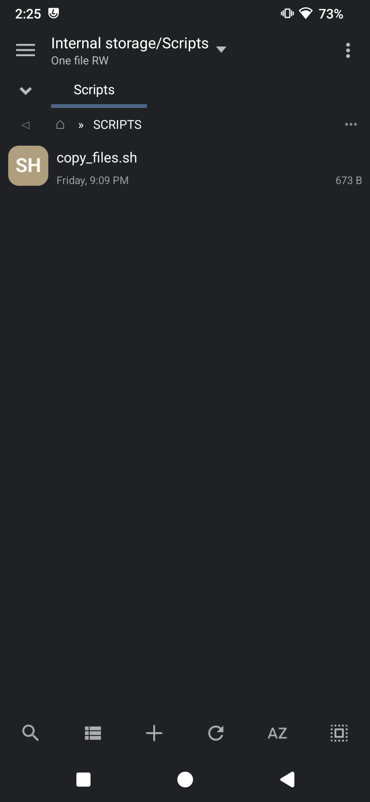
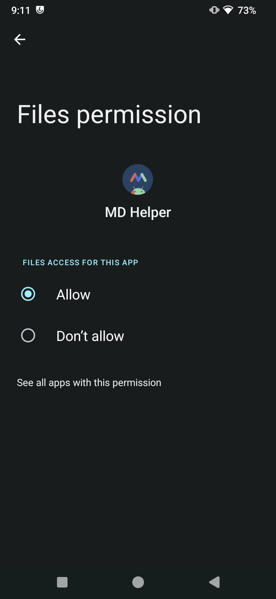
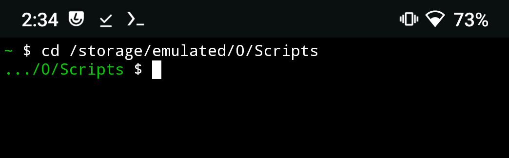
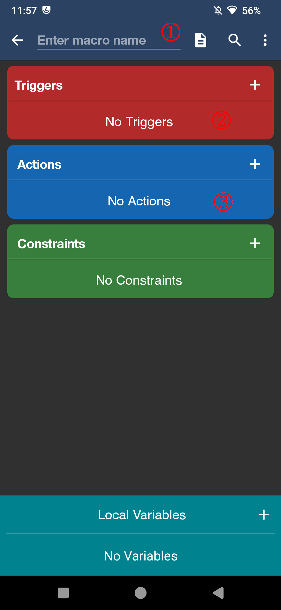
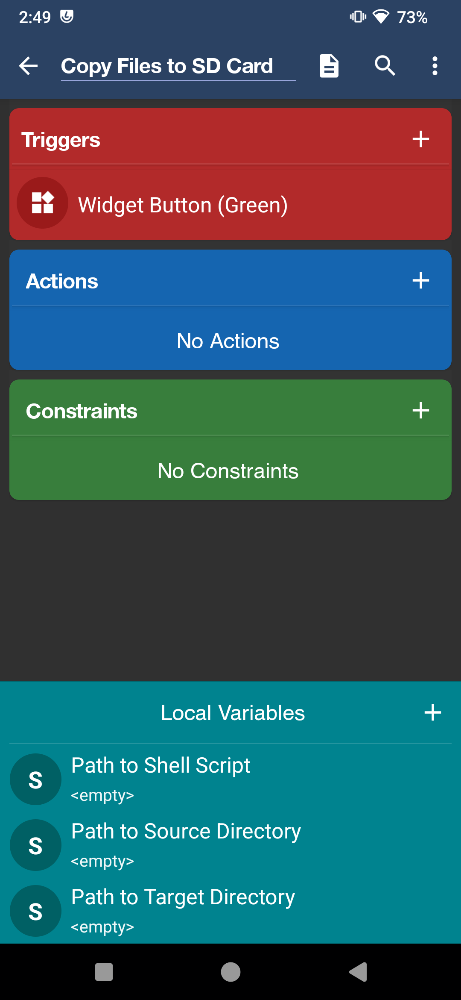
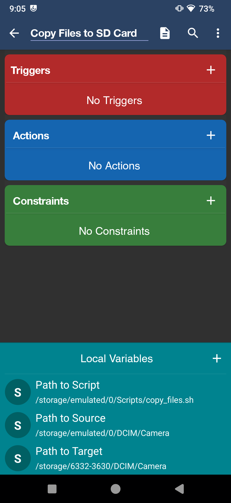
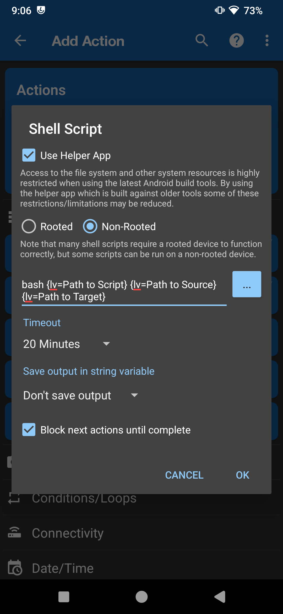
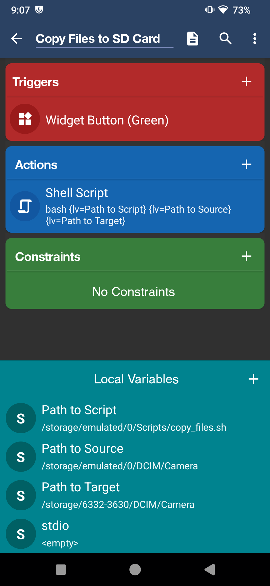

# Copy Files to Directory - Macrodroid

## Purpose
This file wil detail the steps required to move files from a source directory (internal storage) to target directory (External SD Card) using a shell script. This is a follow up to the script I developed [previously](https://github.com/Synt4x3rror/Macrodroid_Python_MoveFiles) because they python script while it does have built in exception handling I find it runs too slow. Addittionally, this setup is much simpler to create and **may** not require root access (untested)!

## Dependencies
This project is targeted for a very specific use case,  if you're going to try and replicate this, you will need the following:

- A phone or tablet running Android OS. At the time of writing, Android 13 was used.
- [Macrodroid](https://play.google.com/store/apps/details?id=com.arlosoft.macrodroid&hl=en_US)
- [Termux](https://f-droid.org/packages/com.termux/) I only use it to grant the batch file executable permission, you can skip it if you have another way of accomplish this, or uninstall it once you're done.
- The [copy_files.sh](./copy_files.sh) bash script.
- Optional: A Micro SD card, but you could move your files to another directory of your choice.

## Instructions

1. Download Macrodroid from the playstore. Give all the required permissions in order for the app to function properly. You may also need to install helper apps for your device. For more info, visit [This](https://macrodroidforum.com/wiki/index.php/MacroDroid_Wiki) link.
2. Copy the [copy_files](./copy_files.sh) file to the android device. This file should be in the device's internal storage. In this example I created a 'Scripts' directory and copied the file to it.\
    </img>
3. (Optional) If you're using the macrodriod helper app, make sure to give it permission to manage files. Macrodroid should also have the appropiate permissions set.\
    </img>
4. Open termux and navigate to the directory where you copied the scripts.
   
5. Use the chmod command to assign the execution permission to [run.sh](./run.sh)
    ``` bash
    chmod +x copy_files.sh
    ```
    (Steps 4 and 5 if you can change execute permission using other method)
6. On Macrodroid choose the "Add Macro" button. On the next screen assign the macro a name.
7. Choose a trigger that works for you. The most basic example I could think of is the widget button, so I'll be using that one in this example.\
   </img>
8. Declare three local **string** type variables to be used in this action block. Each variable should corresponds to:
    <ol type="A">
        <li>The path to the bash script in the filesystem. Include script name and extension</li>
        <li>The path to the source directory where you want files being copied from</li>
        <li>The path to the target directory where you want files copied to</li>
    </ol>
    You can name these variables whatever you want, but it's recommended to name them something you can associate them to what value they're supposed to hold.<br>

    
9. Set the value to the variables you've just created\
    

10. On the actions block add new action. Choose Applications > Shell script.
11. On the dialog set to Non-Rooted mode. Mark the checkbox to use the helper app (If you're using it). On the script textbox type the following:
    ``` bash
        bash {var1} {var2} {var3}
    ```
    Where var1 is the path to the shell script, var2 is the path to the source directory and var3 is the path to the target directory. You can access your previously defined variables from step 9 by pressing on the ellipsis button.\
    

    I've also set the timeout to 20 minutes and chosen to block next action until script is completed. You can set these parameters to your liking.
12. Press the Ok Button and then save your script. Your setup will look something like this:\



## Acknowledgements

I still have very little experience creating bash scripts, so the main [copy_files.sh](./copy_files.sh) was created originally using [ChatGPT](https://chat.openai.com), and slightly modified by me.